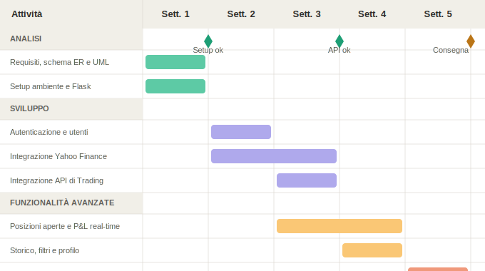

# Specifiche del Progetto — Piattaforma di Monitoraggio e Trading in Tempo Reale

---

## 1. Descrizione del Progetto

Il progetto consiste in una web application che integra due API esterne per offrire un sistema completo di monitoraggio dei mercati finanziari e gestione delle operazioni di trading. L'utente può visualizzare i prezzi in tempo reale di strumenti Forex e Commodities, aprire e chiudere posizioni tramite una API di trading, e consultare lo storico completo delle operazioni.

---

## 2. Obiettivi Generali

- Mostrare in tempo reale i dati di mercato (Forex e Commodities) tramite la Yahoo Finance API.
- Consentire l'apertura, il monitoraggio e la chiusura di posizioni di trading tramite una API di trading dedicata.
- Visualizzare le posizioni attualmente aperte con aggiornamento in tempo reale del profitto/perdita.
- Fornire uno storico completo delle operazioni passate (aperte e chiuse).
- Offrire un'interfaccia chiara e reattiva per il monitoraggio del portafoglio.

---

## 3. Stakeholder e Attori

| Stakeholder    | Ruolo           | Interesse                                              |
|----------------|-----------------|--------------------------------------------------------|
| Studente       | Sviluppatore    | Realizzare il progetto rispettando i requisiti         |
| Docente        | Valutatore      | Verificare correttezza tecnica e completezza           |
| Utente finale  | Trader / Tester | Monitorare il mercato e gestire le proprie operazioni  |

### Attori principali

- **Utente autenticato**: può aprire posizioni, visualizzare il portafoglio e consultare lo storico.
- **Visitatore** (utente non autenticato): può visualizzare i dati di mercato pubblici, senza accedere alle funzioni di trading.

---

## 4. Architettura delle API

### 4.1 Yahoo Finance API

Utilizzata per il recupero dei dati di mercato in tempo reale.

- **Tipo**: REST API (tramite libreria `yfinance` o endpoint pubblici Yahoo Finance)
- **Dati forniti**:
  - Prezzi bid/ask aggiornati per coppie Forex (es. EUR/USD, GBP/JPY)
  - Prezzi di Commodities (es. oro, petrolio, gas naturale)
  - Variazione percentuale, volume, dati OHLC (Open, High, Low, Close)
- **Aggiornamento**: polling periodico o streaming per simulare dati real-time
- **Limitazioni**: API pubblica, soggetta a rate limiting; i dati Forex possono avere un leggero ritardo

### 4.2 API di Trading

Utilizzata per la gestione delle operazioni di trading (apertura/chiusura posizioni).

- **Tipo**: REST API con autenticazione (API Key / Bearer Token)
- **Funzionalità esposte**:
  - Apertura di una posizione (buy/sell, strumento, quantità, stop loss, take profit)
  - Chiusura di una posizione aperta
  - Recupero delle posizioni attualmente aperte
  - Recupero dello storico delle operazioni chiuse
  - Informazioni sul saldo e margine disponibile

---

## 5. Requisiti Funzionali

### 5.1 Requisiti Principali

- Registrazione e login dell'utente con autenticazione sicura.
- Dashboard con prezzi in tempo reale di strumenti Forex e Commodities.
- Apertura di una posizione di trading con parametri configurabili (strumento, direzione, quantità, SL/TP).
- Visualizzazione delle posizioni aperte con P&L aggiornato in tempo reale.
- Chiusura manuale di una posizione aperta.
- Storico delle operazioni con filtri per data, strumento e risultato.
- Pagina di profilo con riepilogo delle performance del conto.

### 5.2 User Stories

- Come utente, voglio registrarmi e accedere in modo sicuro, così le mie operazioni sono legate al mio account.
- Come utente autenticato, voglio vedere i prezzi in tempo reale di Forex e Commodities, così posso prendere decisioni informate.
- Come utente autenticato, voglio aprire una posizione di trading specificando strumento, direzione e dimensione.
- Come utente autenticato, voglio vedere le mie posizioni aperte con il profitto o la perdita attuale.
- Come utente autenticato, voglio chiudere una posizione direttamente dalla dashboard.
- Come utente autenticato, voglio consultare lo storico delle operazioni passate, filtrabile per data e strumento.
- Come visitatore, voglio vedere i dati di mercato pubblici senza fare il login.

---

## 6. Requisiti Non Funzionali

- L'interfaccia deve essere responsiva e aggiornata in tempo reale (polling o WebSocket).
- L'autenticazione deve essere protetta con hashing delle password (es. bcrypt).
- Le credenziali delle API (chiavi, token) devono essere gestite tramite variabili d'ambiente (`.env`), mai nel codice sorgente.
- Il backend deve usare un database relazionale (SQLite in sviluppo, PostgreSQL in produzione) per persistere utenti e storico.
- Il codice backend deve essere organizzato con Blueprints e, preferibilmente, con il repository pattern.
- Il progetto deve essere eseguibile localmente tramite ambiente virtuale Python.
- I dati (storico operazioni, preferiti, impostazioni utente) devono essere persistenti tra sessioni.

---

## 7. Casi d'Uso

### 7.1 Casi d'uso Essenziali

| ID    | Caso d'uso                          | Attore                  |
|-------|-------------------------------------|-------------------------|
| UC01  | Registrazione utente                | Visitatore              |
| UC02  | Login                               | Visitatore              |
| UC03  | Visualizza prezzi di mercato        | Visitatore / Utente     |
| UC04  | Apri posizione di trading           | Utente autenticato      |
| UC05  | Visualizza posizioni aperte         | Utente autenticato      |
| UC06  | Chiudi posizione                    | Utente autenticato      |
| UC07  | Visualizza storico operazioni       | Utente autenticato      |
| UC08  | Visualizza profilo e performance    | Utente autenticato      |

### 7.2 Descrizione Semplificata dei Casi d'Uso

- **UC01 – Registrazione**: il visitatore inserisce nome, email e password; il sistema crea un account e avvia la sessione.
- **UC02 – Login**: l'utente inserisce le credenziali; il sistema le verifica e apre la sessione.
- **UC03 – Visualizza prezzi**: la dashboard mostra prezzi aggiornati recuperati dalla Yahoo Finance API.
- **UC04 – Apri posizione**: l'utente compila un form con strumento, direzione (buy/sell), quantità e parametri opzionali (SL/TP); il sistema invia la richiesta alla API di trading.
- **UC05 – Visualizza posizioni aperte**: il sistema interroga la API di trading e mostra le posizioni con il P&L calcolato in tempo reale.
- **UC06 – Chiudi posizione**: l'utente seleziona una posizione aperta e la chiude; il sistema invia la richiesta di chiusura alla API di trading.
- **UC07 – Storico operazioni**: il sistema recupera e visualizza le operazioni passate, con filtri per data, strumento e tipo.
- **UC08 – Profilo**: l'utente vede il riepilogo del proprio account (saldo, operazioni totali, win rate, P&L cumulativo).

### 7.3 Relazioni tra Casi d'Uso

**`<<include>>`** (comportamento obbligatorio):

- UC04, UC05, UC06, UC07, UC08 `<<include>>` Verifica autenticazione — tutte le operazioni personali richiedono che l'utente sia loggato.
- UC04 `<<include>>` Chiamata API di trading — l'apertura di una posizione richiede sempre l'invocazione dell'API esterna.

**`<<extend>>`** (comportamento opzionale):

- UC06 `<<extend>>` UC05 — la chiusura di una posizione è un'azione opzionale disponibile durante la visualizzazione delle posizioni aperte.
- UC04 `<<extend>>` UC03 — l'utente può decidere di aprire una posizione direttamente dalla schermata di monitoraggio dei prezzi.

---

## 8. Glossario dei Termini

| Termine         | Definizione                                                                 |
|-----------------|-----------------------------------------------------------------------------|
| Forex           | Mercato valutario; scambio tra coppie di valute (es. EUR/USD).              |
| Commodity       | Materia prima scambiata sui mercati (es. oro, petrolio, gas naturale).      |
| Posizione       | Un'operazione di trading aperta su uno strumento finanziario.               |
| Buy / Long      | Operazione di acquisto: si guadagna se il prezzo sale.                      |
| Sell / Short    | Operazione di vendita: si guadagna se il prezzo scende.                     |
| P&L             | Profit & Loss — profitto o perdita corrente di una posizione.               |
| Stop Loss (SL)  | Livello di prezzo a cui la posizione si chiude automaticamente in perdita.  |
| Take Profit (TP)| Livello di prezzo a cui la posizione si chiude automaticamente in profitto. |
| Storico         | Elenco delle operazioni già chiuse, con dettagli su risultato e durata.     |
| API Key         | Credenziale segreta per autenticarsi presso un'API esterna.                 |

---

## 9. Pianificazione e Milestone

| Settimana | Attività                                                                                   |
|-----------|--------------------------------------------------------------------------------------------|
| 1         | Analisi dei requisiti, schema ER e UML, configurazione ambiente, setup Flask e `.env`      |
| 2         | Integrazione Yahoo Finance API, dashboard prezzi in tempo reale (polling/WebSocket)        |
| 3         | Integrazione API di trading: apertura/chiusura posizioni, visualizzazione posizioni aperte |
| 4         | Storico operazioni, filtri, pagina di profilo e statistiche                                |
| 5         | Testing, correzioni bug, documentazione, preparazione consegna GitHub                     |

---

## 10. Stack Tecnologico

| Layer       | Tecnologia                                          |
|-------------|-----------------------------------------------------|
| Backend     | Python, Flask, Blueprints, Repository Pattern       |
| Database    | SQLite (sviluppo) / PostgreSQL (produzione)         |
| ORM         | SQLAlchemy                                          |
| Frontend    | HTML, CSS, JavaScript (con aggiornamenti AJAX/fetch)|
| API Esterne | Yahoo Finance API, API di Trading (REST)            |
| Sicurezza   | bcrypt per le password, variabili d'ambiente `.env` |
| Deploy      | Ambiente virtuale Python (`venv`), eseguibile in locale |
